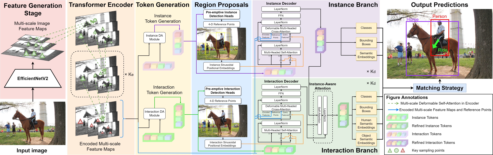

# ERNet: An Efficient and Reliable Human-Object Interaction Detection Network

Abtract: Human-Object Interaction (HOI) detection recognizes how persons interact with objects, which is advantageous in autonomous systems such as self-driving vehicles and collaborative robots. However, current HOI detectors are often plagued by model inefficiency and unreliability when making a prediction, which consequently limits its potential for real-world scenarios. In this paper, we address these challenges by proposing ERNet, an end-to-end trainable convolutional-transformer network for HOI detection. The proposed model employs an efficient multi-scale deformable attention to effectively capture vital HOI features. We also put forward a novel detection attention module to adaptively generate semantically rich instance and interaction tokens. These tokens undergo pre-emptive detections to produce initial region and vector proposals that also serve as queries which enhances the feature refinement process in the transformer decoders. Several impactful enhancements are also applied to improve the HOI representation learning. Additionally, we utilize a predictive uncertainty estimation framework in the instance and interaction classification heads to quantify the uncertainty behind each prediction. By doing so, we can accurately and reliably predict HOIs even under challenging scenarios. Experiment results on HICO-Det, V-COCO, and HOI-A datasets demonstrate that the proposed model achieves state-of-the-art performance in detection accuracy and training efficiency.
